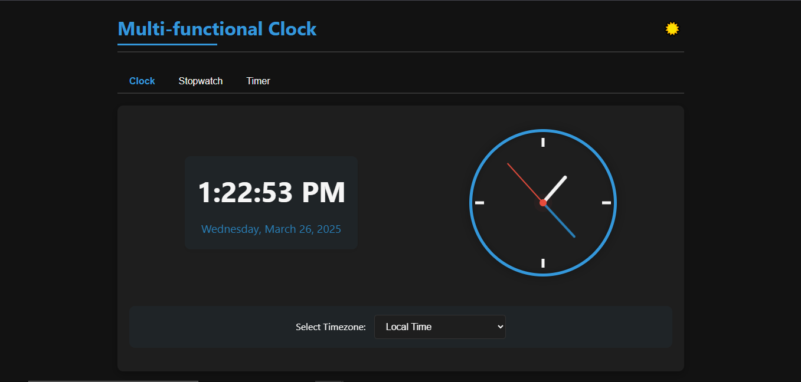

## Live Demo  (https://multi-functional-clock.vercel.app/)


# Multi-functional Clock

## Overview
The **Multi-functional Clock** is a web application that provides a digital and analog clock, a stopwatch, and a countdown timer in a single interface. Users can toggle between dark and light modes, select different time zones, and switch between functionalities seamlessly.

## Features
- **Digital & Analog Clock**: Displays the current time and date.
- **Timezone Selection**: Allows users to view time in different time zones.
- **Stopwatch**: Includes start, stop, reset functions with lap recording.
- **Countdown Timer**: Set custom time duration and start, pause, or reset the countdown.
- **Dark Mode Toggle**: Switch between light and dark themes.
- **Responsive Design**: Works across various screen sizes and devices.

## Technologies Used
- **HTML5**: Structuring the web page.
- **CSS3**: Styling and layout design.
- **JavaScript (ES6+)**: Handling logic and interactivity.

## How to Use
1. **Clock Tab**:
   - View both digital and analog clock.
   - Select a timezone to adjust the display.
2. **Stopwatch Tab**:
   - Click `Start` to begin timing.
   - Click `Stop` to pause.
   - Click `Reset` to clear the time.
   - Record lap times while running.
3. **Timer Tab**:
   - Set hours, minutes, and seconds.
   - Click `Start` to begin countdown.
   - Click `Pause` to stop the timer.
   - Click `Reset` to clear the timer.
4. **Dark Mode Toggle**:
   - Click the moon/sun icon to switch themes.

## Project Setup
1. Clone the repository:
   ```sh
   git clone https://github.com/yourusername/multi-functional-clock.git
   ```
2. Navigate to the project folder:
   ```sh
   cd multi-functional-clock
   ```
3. Open `index.html` in a web browser.

## File Structure
```
📂 multi-functional-clock
 ├── 📄 index.html    # Main HTML file
 ├── 📄 styles.css    # Styling file
 ├── 📄 script.js     # JavaScript logic
 ├── 📂 assets        # Images and icons
```

## Screenshots


## License
This project is open-source and available under the MIT License.

## Author
Developed by **[Sumit Kumar]**. Contributions are welcome!

